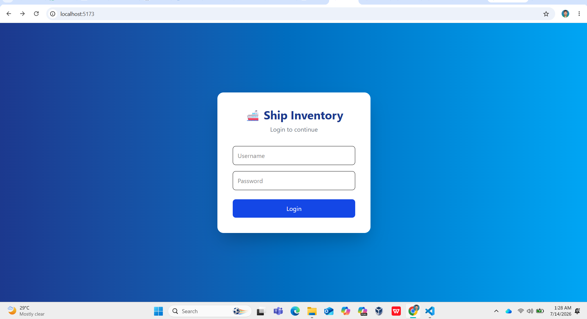
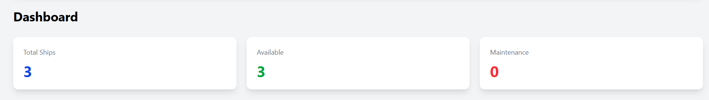
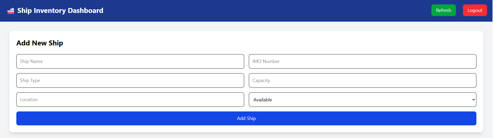
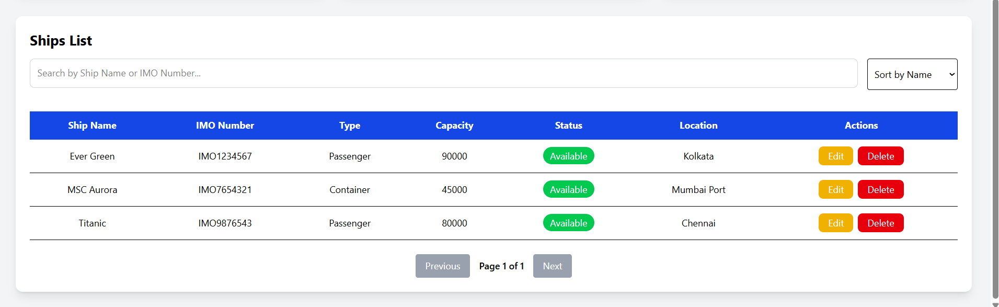

# 🚢 Ship Inventory Management System

A Full Stack Ship Inventory Management System built using React, Node.js, Express, MongoDB and JWT Authentication.

---

## 🚀 Features

- User Login Authentication (JWT)
- Add New Ship
- Update Ship
- Delete Ship
- Search Ships
- Sort Ships
- Pagination
- Refresh Dashboard
- Loading State
- Toast Notifications
- SweetAlert2 Confirmation
- Responsive UI

---

## 🛠 Tech Stack

### Frontend

- React
- Vite
- Tailwind CSS
- Axios
- React Router
- React Toastify
- SweetAlert2

### Backend

- Node.js
- Express.js
- MongoDB
- Mongoose
- JWT Authentication
- bcryptjs

---

## 📂 Folder Structure

```
client/
server/
README.md
```

---

## Installation

### Clone Repository

```bash
git clone <repository-url>
```

### Backend

```bash
cd server
npm install
npm run dev
```

### Frontend

```bash
cd client
npm install
npm run dev
```

---

## Screenshots

### Login Page


### Dashboard


### Add Ship


### Ships List


## Author

Tanmay Shresht

- GitHub: https://github.com/tanmayshresht